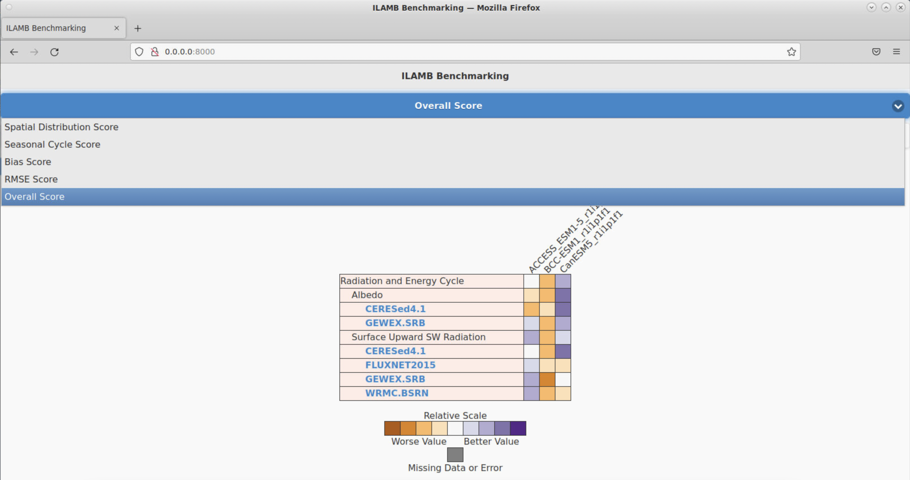
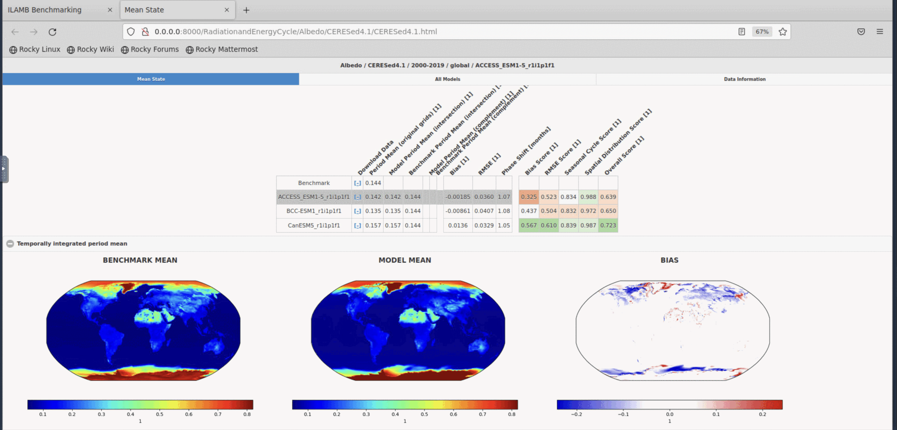
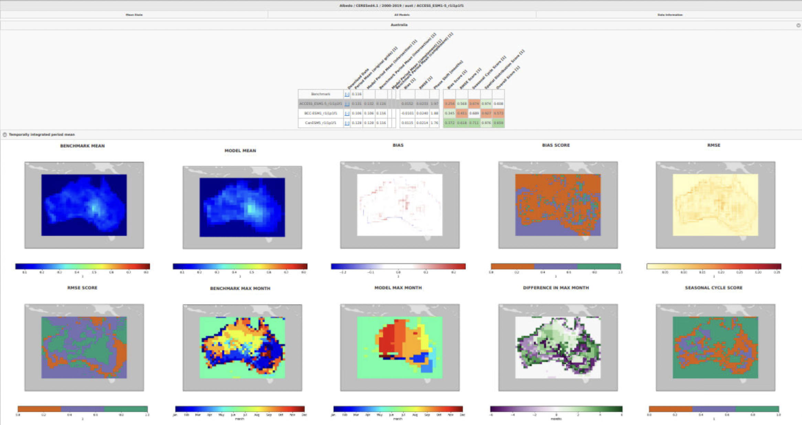

# Getting started with ILAMB at NCI

As earth system models (ESMs) become increasingly complex, there is a growing need for comprehensive and multi-faceted evaluation of model projections. The International Land Model Benchmarking (ILAMB) project is a model-data intercomparison and integration project designed to improve the performance of land models and, in parallel, improve the design of new measurement campaigns to reduce uncertainties associated with key land surface processes.

This document explains how to run the [International Land Model Benchmarking (ILAMB)](https://www.ilamb.org) and International Ocean Model Benchmarking (IOMB) model evaluation tools on NCI infrastracture.

The documentation provided here is designed to supplement, rather than replace, the official [ILAMB documentation](https://www.ilamb.org/doc/). This documentation is tailored to using the tool within the NCI infrastructure. We encourage users to read the ILAMB documentation and to
try on the [ILAMB Tutorial](https://www.ilamb.org/doc/tutorial.html).

ILAMB development is primarily performed by the [RUBISCO](https://www.bgc-feedbacks.org/) Science Focus Area and supported by the [RGMA](https://climatemodeling.science.energy.gov/program-area/regional-global-model-analysis) Activity of the [EESSD](https://science.osti.gov/ber/Research/eessd) division of the [BER](https://science.osti.gov/ber) program in the United States Department of Energy's Office of Science.

### How to cite ILAMB?

*Collier, N., Hoffman, F. M., Lawrence, D. M., Keppel-Aleks, G., Koven, C. D., Riley, W. J., et al. (2018). The International Land Model Benchmarking (ILAMB) system: Design, theory, and implementation. Journal of Advances in Modeling Earth Systems, 10, 2731–2754. https://doi.org/10.1029/2018MS001354*

### ILAMB CMIP confrontations maintained by ACCESS-NRI


While the datasets and software found on this site can be used to confront models, we also maintain a collection of results for the community use. Below is a short description of each along with a preview and links to the full results page.


[Land Comparison of CMIP5 and CMIP6 Models](http://130.56.247.78/build_oi10_2/index.html)
We examine the performance of historical simulations from a selection of coupled Earth system models with a contribution in the CMIP5 and CMIP6 eras.


[Land Comparison of CMIP6 Models](http://130.56.247.78/build_al33/index.html)
This land-focused study includes coupled model results for the historical experiment from the CMIP6 era. We also use this as a testing ground to include new datasets and additional models. If you have a suggestion of a reference dataset or would like to request we include a model, please raise an issue.


[Land Comparison of Offline CMIP6 Models](http://130.56.247.78/build_r33/index.html)
We examine performance differences among a selection of land models (CLM, ISBA-CTRIP, and JSBACH) run using different forcings (GSWP3, CRUJRA, and Princeton).


[Ocean Comparison of CMIP5 and CMIP6 Models](http://130.56.247.78/build_iomb/index.html)
While the focus of ILAMB has been on land, we also have used the software to compare ocean model output which we refer to as International Ocean Model Benchmarking (IOMB). This study is analagous to the land comparison of CMIP5 and CMIP6 era models over the historical period.


## Observations and Model outputs available at NCI.

We currently only support CF-compliant observational datasets and their confrontation with CMORised model outputs.

The [ILAMB-DATA](https://github.com/rubisco-sfa/ILAMB-Data) collection aggregates data from various sources and formats in a CF-compliant, netCDF4 files which can be used for model benchmarking via ILAMB. The collection has been replicated in the [ACCESS-NRI Replicated Datasets for Climate Model Evaluation
](https://geonetwork.nci.org.au/geonetwork/srv/eng/catalog.search#/metadata/f7199_2480_5432_9703) and is maintained by the ACCESS-NRI Model Evaluation and Diagnostics team. Please contact the [ACCESS-NRI team](https://www.access-nri.org.au/model-evaluation-and-diagnostics-med-team/) if you requires help with datasets. The [ILAMB-DATA](https://github.com/rubisco-sfa/ILAMB-Data) is an Open Source project which welcomes contributions from the community.


You can [request access to the ACCESS-NRI collection](https://my.nci.org.au/mancini/project/ct11/join).

Depending on their needs, users may require access to a range of NCI data collections and projects.
Here we list the NCI collections required to run the CMIP confrontations examples available with ILAMB (see [here](https://github.com/rubisco-sfa/ILAMB/tree/master/src/ILAMB/data)):


| Project Name   | Project Code  | DOI  |
| :-:            | :-:           |:-:   |
|   Earth System Grid Federation (ESGF) Australian CMIP6-era Datasets | fs38 [join](https://my.nci.org.au/mancini/project/fs38/join) |   [10.25914/5e6acd0492b39](https://dx.doi.org/10.25914/5e6acd0492b39)   |
|  Earth System Grid Federation (ESGF) Replicated CMIP6-era Datasets  | oi10 [join](https://my.nci.org.au/mancini/project/oi10/join) |   [10.25914/Q1CT-RM13](https://dx.doi.org/10.25914/Q1CT-RM13)   |
|   CSIRO-Mk3-6-0 model output prepared for CMIP5  | rr3 [join](https://my.nci.org.au/mancini/project/rr3/join) |   N/A |
|    Earth System Grid Federation (ESGF) Replicated CMIP5-era Datasets  | al33 [join](https://my.nci.org.au/mancini/project/al33/join) |   [10.25914/5b98b0f5ef29d](https://dx.doi.org/10.25914/5b98b0f5ef29d)|

Projects for data analysis (choose one):

| Project Name   | Project Code  |
| :-:            | :-:           |
| ACCESS MED Analysis Environments | xp65 [join](https://my.nci.org.au/mancini/project/xp65/join) |
| CLEX Analysis Environments | h55 [join](https://my.nci.org.au/mancini/project/hh5/join) |

## ILAMB on NCI-Gadi

For NCI users, ACCESS-NRI is providing a conda environment with the latest version of ILAMB through project `xp65`. It is also provided through the CLEX analysis environment project `hh5`.

To load the module via project `xp65`, you need to prompt:
```
>>> module use /g/data/xp65/public/modules
>>> module load conda/access-med
```
For `hh5`, you need to use:
```
>>> module use /g/data/hh5/public/modules
>>> module load conda/analysis3
```

To run `ilamb`, you need to execute the command `ilamb-run` with a number of arguments/files:
```py
ilamb-run --config config.cfg --model_setup model_setup.txt --regions global
```

- `config.cfg` defines which observables and observational datasets will be compared
- `model_setup.txt` defines the paths of the models that will be compared

Below we explain how to setup the necessary directory structures and the example files mentioned above. For detailed information on the arguments of `ilamb-run`, please consult the official <a href="https://www.ilamb.org/doc/ilamb_run.html" target="_blank">ILAMB documentation</a>.

## ILAMB directory structure

### ILAMB_ROOT

ILAMB requires files to be organised in a specific directory structure of `DATA` and `MODELS`.
The root of this directory structure is the `ILAMB_ROOT` path (you should export it as `$ILAMB_ROOT`):

```
export ILAMB_ROOT=PATH/OF/ILAMB_ROOT/DIRECTORY
```
  
The following tree represents a typical ILAMB_ROOT setup for CMIP comparison on NCI/Gadi:

```
$ILAMB_ROOT/
|-- DATA -> /g/data/ct11/access-nri/replicas/ILAMB
`-- MODELS
    |-- ACCESS-ESM1-5
    |   `-- historical
    |       `-- r1i1p1f1
    |           |-- cSoil.nc -> /g/data/fs38/publications/CMIP6/CMIP/CSIRO/ACCESS-ESM1-5/historical/r1i1p1f1/Emon/cSoil/gn/latest/cSoil_Emon_ACCESS-ESM1-5_historical_r1i1p1f1_gn_185001-201412.nc
```

There are two main branches in this directory:

1. the `DATA` directory: this is where we keep the observational datasets each in a subdirectory bearing the name of the variable. This directory can be setup as a symlink to the [ACCESS-NRI Replicated Datasets for Climate Model Evaluation
](https://geonetwork.nci.org.au/geonetwork/srv/eng/catalog.search#/metadata/f7199_2480_5432_9703).

2. the `MODEL` directory: this directory can be populated with symbolic links to the model outputs.

To facilitate the setup of an ILAMB-ROOT tree. ACCESS-NRI provides a tool to automatically generate the required folder structure.
The `ilamb-tree-generator` is available in the `access-med` environment of the `xp65` project.

The tool will automatically create the folder structure above. Models output can be added by listing them in a yaml file as follow:

```yaml
datasets:
  - {institute: CSIRO, dataset: ACCESS-ESM1-5, project: CMIP6, exp: historical, ensemble: r1i1p1f1}
  - {institute: BCC, dataset: BCC-ESM1, project: CMIP6, exp: historical, ensemble: r1i1p1f1}
  - {institute: CCCma, dataset: CanESM5, project: CMIP6, exp: historical, ensemble: r1i1p1f1}
```

The tool can then be run from the command line:

```bash
ilamb-tree-generator --datasets models.yml --ilamb_root $ILAMB_ROOT
```

Note that in order to access these models on Gadi, you will need to join the NCI projects that are associated with the models originally paths and you will need to add these projects to the storage access keywords for [computing jobs](#submitting-a-pbs-job) lateron.

### ILAMB configuration file: `config.cfg`

Now that we have the data, we need to setup a configure file which the ILAMB package will use to initiate a benchmark study. With this file, you configure comparison sections and define which variables from which dataset will be compared. You can find more information on adjusting this file on the official <a href="https://www.ilamb.org/doc/first_steps.html#configure-files" target="_blank">ILAMB documentation</a>.

An example configure file for ILAMB on <i>Gadi</i> could be called `config.cfg` and look like this for comparing your models with two variables of the radiation and energy cycle as measured by <a href="https://ceres.larc.nasa.gov" target="_blank">Clouds and the Earth’s Radiant Energy System (CERES) project</a>:
```
# This configure file specifies comparison sections, variables and observational data for running ILAMB on Gadi.

# See https://www.ilamb.org/doc/first_steps.html#configure-files for the ILAMB Tutorial that addesses Configure Files

# Structure:
# [h1:] Sections
# [h2:] Variables
# [...] Observational Datasets and their paths

############################################################################

[h1: Radiation and Energy Cycle]

[h2: Surface Upward SW Radiation]
variable = "rsus"

[CERES]
source   = "DATA/rsus/CERESed4.1/rsus.nc"

[h2: Albedo]
variable = "albedo"
derived  = "rsus/rsds"

[CERES]
source   = "DATA/albedo/CERESed4.1/albedo.nc"
```

### ILAMB model selection: `model_setup.txt`

In the `model_setup.txt`, you can select all the model output that you want to compare.

Remember that ILAMB is expecting the model output and its variables to be saved in a specific format. See the above [ILAMB_ROOT/MODELS](#ilamb_rootmodels) description on how to find and create the correct links.

Assuming you want to compare the three models that we used in [ILAMB_ROOT/MODELS](#ilamb_rootmodels) (ACCESS-ESM1.5, BCC-ESM1, and CanESM5), you would need to create a `model_setup.txt` file wehere you define both the model labels and their paths:

```
# Model Name (used as label), ABSOLUTE/PATH/TO/MODELS or relative to $ILAMB_ROOT/ , Optional comments
ACCESS_ESM1-5_r1i1p1f1      , MODELS/ACCESS-ESM1-5/historical/r1i1p1f1              , CMIP6
BCC-ESM1_r1i1p1f1           , MODELS/BCC-ESM1/historical/r1i1p1f1                   , CMIP6
CanESM5_r1i1p1f1            , MODELS/CanESM5/historical/r1i1p1f1                    , CMIP6
```

## Run ILAMB

Now that we have the configuration file set up, you can run the study using the `ilamb-run` script via the aforementioned
```
ilamb-run --config config.cfg --model_setup model_setup.txt --regions global
```

Because of the computational costs, you need to run ILAMB through a Portable Batch System (PBS) job on Gadi.

### Submitting a PBS job

The following default PBS file, let's call it `ilamb_test.job`, can help you to setup your own, while making sure to use the correct project (#PBS -P) to charge your computing cost to:

```
#!/bin/bash

#PBS -N ilamb_test
#PBS -l wd
#PBS -P your_compute_project_here
#PBS -q normalbw
#PBS -l walltime=0:20:00  
#PBS -l ncpus=14
#PBS -l mem=63GB           
#PBS -l jobfs=10GB        
#PBS -l storage=gdata/ct11+gdata/hh5+gdata/xp65+gdata/fs38+gdata/oi10

# ILAMB is provided through projects xp65 and hh5. We will use the latter here
#module use /g/data/xp65/public/modules
#module load conda/access-med
module use /g/data/hh5/public/modules
module load conda/analysis3

# Define the ILAMB Path, expecting it to be where you start this job from
export ILAMB_ROOT=./
export CARTOPY_DATA_DIR=/g/data/xp65/public/apps/cartopy-data

# Run ILAMB in parallel with the config.cfg configure file for the models defined in model_setup.txt
mpiexec -n 10 ilamb-run --config config.cfg --model_setup model_setup.txt --regions global
```

You should adjust this file to your own specifications (including the storage access to your models). Save the file in the `$ILAMB_ROOT` and submit its job to the queue from there via 
```
qsub ilamb_test.job
```

Running this job will create a `_build` directory with the comparison results within `$ILAMB_ROOT`. You can adjust the place of this directory via a agrument `--build_dir` argument for `ilamb-run`.

## Visualisation of ILAMB outputs

Result visualisation is an important part of ilamb, it provide a lot of visualized graphs to allow users to evaluate the performance of each models for various aspects. The result is shown in an `html` page.

NCI provides a web-based graphical interface of the Australian Research Environment (ARE) for such purposes.

### Australian Research Environment (ARE)

ARE is a web-based graphical interface for performing your computational research. It combines the familiarity of your regular desktop/laptop with the power of NCI's world-class research HPC capabilities. ARE gives you access to NCI's Gadi supercomputer and data collections, all from a simple, graphical interface. ARE consists of a number of applications that support your research such as Virtual Desktop, JupyterLab, Terminal, etc.

In this tutorial, we mainly provide guidance for use ARE for ilamb result. For user who want more imformation about ARE, you can find it [here](https://opus.nci.org.au/display/Help/ARE+User+Guide). 

#### Access to ARE

ARE can be accessed at [are.nci.org.au](https://are.nci.org.au/). NCI users can use NCI username and password to login. If you are a new user of NCI, please apply an account at [here](https://my.nci.org.au/mancini/signup/0).


#### Virtual Desktop

When you log into ARE, click Virsual Desktop Instance(VDI), and you will see the setup page, it will setup the VDI just like you setup your PBS job on NCI CLI, so just follow the instruction on the page. Make sure that the project on which your `ilamb` data is stored is added to the 'Storage' field. Otherwise you cannot access the directory in your VDI. NCI provides more both user guides for [VDI](https://opus.nci.org.au/display/Help/2.1.+Connecting+to+the+VDI) and [PBS directives](https://opus.nci.org.au/display/Help/PBS+Directives+Explained).


**Launch VDI**
 When you get everything setup and click Launch button you'll be redirected to this page:

 

Maybe you will be in queue for a while, it depends on what kind of queue and how much source you apply, when the status at the top right turn to running, you can click `Launch VDI Desktop` to access your VDI.

**Host ilamb result**

This is the Desktop of your VDI:


Then open a terminal (top left of the VDI screen) and navigate to the ilamb result directory (default is `_build` directory), and use commmand below to host a localserver.
```
python3 -m http.server
```

You can then start Firefox in the VDI screen and access the following address:
localhost address:
```
http://0.0.0.0:8000/
```

For our `config.cfg` example we expect to see the following website (which shows the available observational data in blue after clicking on <i>Albedo</i> and <i>Surface Upward SW Radiation</i>):



Clicking on `CERESed4.1` under the `Albedo` measurements then opens a new tab which allows you to browse through more extended and quantitative comparisons of your selected Models when confronted with measurements from the <a href="https://ceres.larc.nasa.gov" target="_blank">Clouds and the Earth’s Radiant Energy System (CERES) project</a>:



#### Jupyter-hub interface

The Jupyter interface available via ARE can also be used to visualise the outputs of ILAMB.

## Advanced usages

The analysis with ILAMB can be adjusted in many ways. We suggest to read the ILAMB documentation and <a href="https://www.ilamb.org/doc/ilamb_run.html" target="_blank">tutorials</a> for a complete overview, as we only showcase a few examples below. 

### Changing configure file definitions

You can find more information on adjusting this file on the official <a href="https://www.ilamb.org/doc/first_steps.html#configure-files" target="_blank">ILAMB documentation</a>.

Below we provide a list of definitions you can modify in config file:
```
source              = None
#Full path to the observational dataset

cmap                = "jet"
#The colormap to use in rendering plots (default is 'jet')

variable            = None
#Name of the variable to extract from the source dataset

alternate_vars      = None
#Other accepted variable names when extracting from models

derived             = None
#An algebraic expression which captures how the confrontation variable may be generated

land                = False
#Enable to force the masking of areas with no land (default is False)

bgcolor             = "#EDEDED"
#Background color

table_unit          = None
#The unit to use when displaying output in tables on the HTML page

plot_unit           = None
#The unit to use when displaying output on plots on the HTML page

space_mean          = True
#Disable to compute sums of the variable over space instead of mean values

relationships       = None
#A list of confrontations with whose data we use to study relationships, the syntax is "h2 tag/observational dataset". You will see the relationship part in the output if you specify some relationship.

ctype               = None
#Choose a specific Confrontion class. 

regions             = None
#Specify the regions of confrontation

skip_rmse           = False
#akip rmse in program

skip_iav            = True
#Ship iav in program

mass_weighting      = False
#if switch to true, using an average data in a period to normalize

weight              = 1    
# if a dataset has no weight specified, it is implicitly 1

```
Above are the general attributes you can use in config file. However, `ILAMB` has develop many sub-classes of Confrontation for some specific case, there are some specific attribute in those sub-classes:
```
--ConfCO2:

emulated_flux       = nbp    
# prety much the same as 'derived', default is nbp in this case

sites               = None
# in this confrontation, it will use site data instead of space data, this attribute is to specify which sites will be used.

force_emulation     = False
# if switch to true, using emulated_flux variable even you have co2 in model-result.

never_emulation     = False
# is switch to true, only use co2 in confront even if you specify emulated_flux and dont have co2 in model_result

lat_bands           = "-90,-60,-23,0,+23,+60,+90"
# it will give a latitude boundary for sites to separate those sites into interval.

--ConfGSNF:

model_flux          = "nee"
# use one variable or derive of some variables to replace the target variable in model_result. It's quite useful if you don't have the variable required by this confrontation in your model_result.

--ConfNBP:

skip_taylor         = "False"
# skip Temporal distribution in program

--ConfSoilCarbon:

soilc_source        = None
# path to observational dataset of 'solic'.

npp_source          = None
# path to observational dataset of 'npp'.

tas_source          = None
# path to observational dataset of 'tas'.

pr_source           = None
# path to observational dataset of 'pr'.

pet_source          = None
# path to observational dataset of 'pet'

fracpeat_source     = None
# path to observational dataset of 'fracpeat'

y0                  = 1980.0
# start year

yf                  = 2006.0
# end year

--ConfEvapFraction:

hfss_source         =None (*)
# path to observational dataset of 'hfss'

hfls_source         =None (*)
# path to observational dataset of 'hlss'

#caution: those two variable is conpulsory if you specify ctype = 'ConfEvapFraction'

--ConfTWSA:

nbasins             = 30
# Adding a member variable called basins, add them as regions

--ConfPermafrost

y0                  = 1985.0
# start year

yf                  = 2005.0
# end year

dmax                = 3.5
# The maximum depth to consider in [m]

Teps                = 273.15
# The temperature threshold to use to indicate permafrost [K]

--ConfAlbedo:

energy_threshold    = 10
# engery threshold to build a mask

skip_weighting      = False
# options while run the mean state analysis

skip_cycle          = False
# options while run the mean state analysis
```
### Model selection via `--model_setup` or `--model_root`

In the above examples, we already showed you how select only a few examples of the available models, which are selected with a file (e.g. `model_setup.txt`) that is used via the `--model_setup` argument.

You can, however, also select all models, by simply using the keyword `--model_root $ILAMB_ROOT/MODELS/`.

### Run specific regions via the `--regions` argument

In the above examples, we have always chosen to perform comparisons on a `global` level.

You can, however, also choose other predefined regions like `aust` (for Australia) based on the <a href="http://www.globalfiredata.org" target="_blank">Global Fire Emissions Database</a> or define your own regions. To run ILAMB for several regions, use the `--regions` option and include the region labels delimited by spaces, e.g. `--regions global aust`

To use your own region, you need to create a new file, for example `regions.txt` with latidude and longitude limits for your regions and use it with the argument `--regions regions.txt`. This could be advisable if you want to include Tasmania (latitudes down to -43.75 degrees) into your comparisons for Australia, which is currently excluded from the default ILAMB `aust` definition (cutoff at -41.25 degress following the definition of the Global Fire Emissions Database):
```
#label, name                         , lat_min, lat_max, lon_min, lon_max
au_tas, Australia including Tasmania , -43.75 , -10.50 , 112.00 , 154.00
```

An Australia-focussed ILAMB run with the same setup as above and default `aust` region, would for example produce the following comparisons for ACCESS-ESM1.5 when confronted with albedo measurements of CERES:



For even more detailed region definitions, you can follow the <a href="https://www.ilamb.org/doc/custom_regions.html" target="_blank">ILAMB tutorial for custom regions</a>.

### Fix your setup with `ilamb_doctor`

`ilamb_doctor ` is a script you can use to diagnosing some missing model values or what is incorrect or missing from a given analysis. It takes options similar to `ilamb-run` and is used in the following way:
```[ILAMB/test]$ ilamb-doctor --config test.cfg --model_root ${ILAMB_ROOT}/MODELS/CLM

Searching for model results in /Users/ncf/ILAMB//MODELS/CLM

                                   CLM40n16r228
                                   CLM45n16r228
                                   CLM50n18r229

We will now look in each model for the variables in the ILAMB
configure file you specified (test.cfg). The color green is used to reflect
which variables were found in the model. The color red is used to
reflect that a model is missing a required variable.

                           Biomass/GlobalCarbon CLM40n16r228 biomass or cVeg
                                        ... (abbreviated)
                            Precipitation/GPCP2 CLM50n18r229 pr
```
Here we have run the command on some inputs in our test directory. You will see a list of the confrontations we run and the variables which are required or their synonyms. What is missing in this tutorial is the text coloring which will indicate if a given model has the required variables.

### Advanced Visualisation with the Land Model Testbed (LMT) unified dashboard

The Land Model Testbed (LMT) unified dashboard, powered by Tabulator and the jQuery JS library, illustrates the high-level results from analysis and benchmarking software in the form of data tables (similar to a 2-D heat map). It treats the result as a function of multiple independent (hyperdimensional) inputs and displays the result as a combination of the two inputs.

LMT is the tool which ilamb officially used to deploy their result, it has some useful function which help people to go through ilamb result, so we suggest NCI user to use LMT aswell.

#### Install LMT
There are two ways to get LMT installed, first is you can get it on their official repo [here](https://github.com/climatemodeling/unified-dashboard)

```
git clone https://github.com/climatemodeling/unified-dashboard.git
```

#### Use LMT
When you access to the directory you cloned, you will see the structure like this:
```
.
├── README.md
├── assets
├── dist
├── gulpfile.js
├── package-lock.json
└── package.json
```

Then you need to copy or build softlink of all the subdirectory and `scalar_database.json` in your ilamb result directory to `dist`.

then cd to `dist` and build your localhost there with command:
```
python3 -m http.server
```

and you will see your ilamb result been deployed by LMT.
