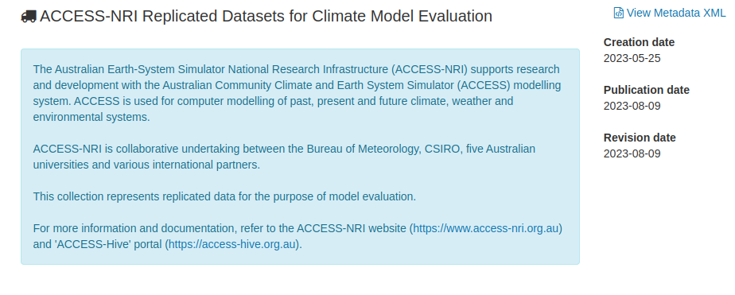
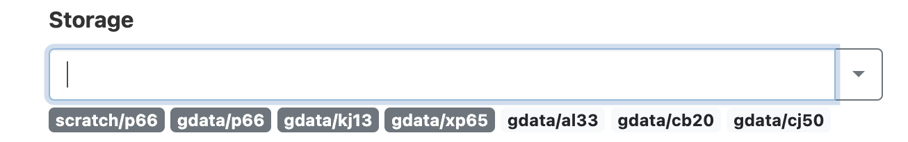
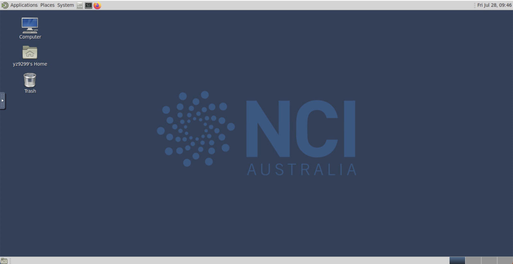

# Getting started with ILAMB at NCI

As earth system models (ESMs) become increasingly complex, there is a growing need for comprehensive and multi-faceted evaluation of model projections. The International Land Model Benchmarking (ILAMB) project is a model-data intercomparison and integration project designed to improve the performance of land models and, in parallel, improve the design of new measurement campaigns to reduce uncertainties associated with key land surface processes.

This document explains how to run the [International Land Model Benchmarking (ILAMB)](https://www.ilamb.org) and International Ocean Model Benchmarking (IOMB) model evaluation tools on NCI infrastracture.

The documentation provided here is designed to supplement, rather than replace, the official [ILAMB documentation](https://www.ilamb.org/doc/). This documentation is tailored to using the tool within the NCI infrastructure. We encourage users to read the ILAMB documentation and to
try on the [ILAMB Tutorial](https://www.ilamb.org/doc/tutorial.html).

ILAMB development is primarily performed by the [RUBISCO](https://www.bgc-feedbacks.org/) Science Focus Area and supported by the [RGMA](https://climatemodeling.science.energy.gov/program-area/regional-global-model-analysis) Activity of the [EESSD](https://science.osti.gov/ber/Research/eessd) division of the [BER](https://science.osti.gov/ber) program in the United States Department of Energy's Office of Science.

### How to cite ILAMB?

*Collier, N., Hoffman, F. M., Lawrence, D. M., Keppel-Aleks, G., Koven, C. D., Riley, W. J., et al. (2018). The International Land Model Benchmarking (ILAMB) system: Design, theory, and implementation. Journal of Advances in Modeling Earth Systems, 10, 2731–2754. https://doi.org/10.1029/2018MS001354*

### ILAMB CMIP confrontations maintained by ACCESS-NRI


While the datasets and software found on this site can be used to confront models, we also maintain a collection of results for the community use. Below is a short description of each along with a preview and links to the full results page.


[Land Comparison of CMIP5 and CMIP6 Models](http://130.56.247.78/build_oi10_2/index.html)
We examine the performance of historical simulations from a selection of coupled Earth system models with a contribution in the CMIP5 and CMIP6 eras.


[Land Comparison of CMIP6 Models](http://130.56.247.78/build_al33/index.html)
This land-focused study includes coupled model results for the historical experiment from the CMIP6 era. We also use this as a testing ground to include new datasets and additional models. If you have a suggestion of a reference dataset or would like to request we include a model, please raise an issue.


[Land Comparison of Offline CMIP6 Models](http://130.56.247.78/build_r33/index.html)
We examine performance differences among a selection of land models (CLM, ISBA-CTRIP, and JSBACH) run using different forcings (GSWP3, CRUJRA, and Princeton).


[Ocean Comparison of CMIP5 and CMIP6 Models](http://130.56.247.78/build_iomb/index.html)
While the focus of ILAMB has been on land, we also have used the software to compare ocean model output which we refer to as International Ocean Model Benchmarking (IOMB). This study is analagous to the land comparison of CMIP5 and CMIP6 era models over the historical period.


## Observations and Model outputs available at NCI.

We currently only support CF-compliant observational datasets and their confrontation with CMORised model outputs.

The [ILAMB-DATA](https://github.com/rubisco-sfa/ILAMB-Data) collection aggregates data from various sources and format in a CF-compliant, netCDF4 file which can be used for model benchmarking via ILAMB. The collection has been replicated in the [ACCESS-NRI Replicated Datasets for Climate Model Evaluation
](https://geonetwork.nci.org.au/geonetwork/srv/eng/catalog.search#/metadata/f7199_2480_5432_9703) and is maintained by the ACCESS-NRI Model Evaluation and Diagnostics team. Please contact ACCESS-NRI if you requires help with datasets. The [ILAMB-DATA](https://github.com/rubisco-sfa/ILAMB-Data) is an Open Source project which welcomes contributions from the community.




You can [request access to the ACCESS-NRI collection](https://my.nci.org.au/mancini/project/ct11/join).

Depending on their needs, users may require access to a range of NCI data collections and projects.
Here we list the NCI collections required to run the CMIP confrontations examples available with ILAMB (see [here](https://github.com/rubisco-sfa/ILAMB/tree/master/src/ILAMB/data)):


| Project Name   | Project Code  | DOI  |
| :-:            | :-:           |:-:   |
|   Earth System Grid Federation (ESGF) Australian CMIP6-era Datasets | fs38 [join](https://my.nci.org.au/mancini/project/fs38/join) |   [10.25914/5e6acd0492b39](https://dx.doi.org/10.25914/5e6acd0492b39)   |
|  Earth System Grid Federation (ESGF) Replicated CMIP6-era Datasets  | oi10 [join](https://my.nci.org.au/mancini/project/oi10/join) |   [10.25914/Q1CT-RM13](https://dx.doi.org/10.25914/Q1CT-RM13)   |
|   CSIRO-Mk3-6-0 model output prepared for CMIP5  | rr3 [join](https://my.nci.org.au/mancini/project/rr3/join) |   N/A |
|    Earth System Grid Federation (ESGF) Replicated CMIP5-era Datasets  | al33 [join](https://my.nci.org.au/mancini/project/al33/join) |   [10.25914/5b98b0f5ef29d](https://dx.doi.org/10.25914/5b98b0f5ef29d)|

Projects for data analysis (choose one):

| Project Name   | Project Code  |
| :-:            | :-:           |
| ACCESS MED Analysis Environments | xp65 [join](https://my.nci.org.au/mancini/project/xp65/join) |

## ILAMB on NCI-Gadi

For NCI users, ACCESS-NRI is providing a conda environment with the latest version of ILAMB. 

The module can be loaded as follow:

```
>>> module use /g/data/xp65/public/modules
>>> module load conda/access-med
```

## Configuring ILAMB

### ILAMB_ROOT

ILAMB requires files to be organised in a specific directory structure of `DATA` and `MODELS`.
The root of this directory structure is the `ILAMB_ROOT` path.
  
The following tree represents a typical ILAMB_ROOT setup for CMIP comparison on NCI/Gadi:

```
ILAMB_ROOT/
|-- DATA -> /g/data/ct11/access-nri/replicas/ILAMB
`-- MODELS
    |-- ACCESS-ESM1-5
    |   `-- historical
    |       `-- r1i1p1f1
    |           |-- cSoil.nc -> /g/data/fs38/publications/CMIP6/CMIP/CSIRO/ACCESS-ESM1-5/historical/r1i1p1f1/Emon/cSoil/gn/latest/cSoil_Emon_ACCESS-ESM1-5_historical_r1i1p1f1_gn_185001-201412.nc

```

There are two main branches in this directory:

1. the `DATA` directory: this is where we keep the observational datasets each in a subdirectory bearing the name of the variable. This directory can be setup as a symlink to the [ACCESS-NRI Replicated Datasets for Climate Model Evaluation
](https://geonetwork.nci.org.au/geonetwork/srv/eng/catalog.search#/metadata/f7199_2480_5432_9703)

2. the `MODEL` directory: this directory can be populated with symbolic links to the model outputs.

To facilitate the setup of an ILAMB-ROOT tree. ACCESS-NRI provides a tool to automatically generate the required folder structure.
The `ilamb-tree-generator` is available in the `access-med` environment of the `xp65` project.

The tool will automatically create the folder structure above. Models output can be added by listing them in a yaml file as follow:

```yaml
datasets:
  - {institute: CSIRO, dataset: ACCESS-ESM1-5, project: CMIP6, exp: historical, ensemble: r1i1p1f1, version: latest}
  - {institute: BCC, dataset: BCC-ESM1, project: CMIP6, exp: historical, ensemble: r1i1p1f1, version: v20181114}
  - {institute: CCCma, dataset: CanESM5, project: CMIP6, exp: historical, ensemble: r1i1p1f1, version: v20190429}
```

The tool can then be run from the command line:

```bash
ilamb-tree-generator --datasets models.yml --ilamb_root ILAMB_ROOT
```

### ILAMB configuration file

Now that we have the data, we need to setup a `config` file which the ILAMB package will use to initiate a benchmark study.  

ILAMB provides [default config files](https://github.com/rubisco-sfa/ILAMB/tree/master/src/ILAMB/data).

Below we explain both which variables you can define, but start by showing you the minimum setup from the [tutorial's](https://www.ilamb.org/doc/first_steps.html). `sample.cfg` [file](https://github.com/rubisco-sfa/ILAMB/blob/master/src/ILAMB/data/sample.cfg):

```
# This configure file specifies the variables

[h1: Radiation and Energy Cycle]

[h2: Surface Upward SW Radiation]
variable = "rsus"

[CERES]
source   = "DATA/rsus/CERES/rsus_0.5x0.5.nc"

[h2: Albedo]
variable = "albedo"
derived  = "rsus/rsds"

[CERES]
source   = "DATA/albedo/CERES/albedo_0.5x0.5.nc"
```

In brief: This file allows you to create different header descriptions of the experiments (`h1`: top level for grouping of variables, `h2`: sub-level for each variable), but most importantly the `variable`s that we will look into and their `source`. In the eaxmple, `rsus` (*Surface Upward Shortwave Radiation*) and `albedo` are the used variables. The latter is actually derived from two variables by dividing the *Surface Upward Shortwave Radiation* by the *Surface Downward Shortwave Radiation*, `derived = rsus/rsds`. Finally, sources are defined as `source` with a text-font header without `h1` or `h2`.

## Run ILAMB

Now that we have the configuration file set up, you can run the study using the `ilamb-run` script. Executing the following command at the $ILAMB_ROOT directory will run ILAMB as specified in your `sample.cfg` for all models of the `model_root` and all regions (`global`) of the world:
```
ilamb-run --config sample.cfg --model_root $ILAMB_ROOT/MODELS/ --regions global
```
If you are on some institutional resource, you may need to launch the above command using a submission script, or request an interactive node. As the script runs, it will yield output which resembles the following:
```
Searching for model results in /Users/ncf/sandbox/ILAMB_sample/MODELS/

                                          CLM40cn

Parsing config file sample.cfg...

                   SurfaceUpwardSWRadiation/CERES Initialized
                                     Albedo/CERES Initialized

Running model-confrontation pairs...

                   SurfaceUpwardSWRadiation/CERES CLM40cn              Completed  37.3 s
                                     Albedo/CERES CLM40cn              Completed  44.7 s

Finishing post-processing which requires collectives...

                   SurfaceUpwardSWRadiation/CERES CLM40cn              Completed   3.3 s
                                     Albedo/CERES CLM40cn              Completed   3.3 s

Completed in  91.8 s
```
What happened here? First, the script looks for model results in the directory you specified in the `--model_root` option. It will treat each subdirectory of the specified directory as a separate model result. Here since we only have one such directory, `CLM40cn`, it found that and set it up as a model in the system. Next it parsed the configure file we examined earlier. We see that it found the CERES data source for both variables as we specified it. If the source data was not found or some other problem was encountered, the green `Initialized` will appear as red text which explains what the problem was (most likely `MisplacedData`). If you encounter this error, make sure that `ILAMB_ROOT` is set correctly and that the data really is in the paths you specified in the configure file.

Next we ran all model-confrontation pairs. In our parlance, a confrontation is a benchmark observational dataset and its accompanying analsys. We have two confrontations specified in our configure file and one model, so we have two entries here. If the analysis completed without error, you will see a green `Completed` text appear along with the runtime. Here we see that `albedo` took a few seconds longer than `rsus`, presumably because we had the additional burden of reading in two datasets and combining them.

The next stage is the post-processing. This is done as a separate loop to exploit some parallelism. All the work in a model-confrontation pair is purely local to the pair. Yet plotting results on the same scale implies that we know the maxmimum and minimum values from all models and thus requires the communcation of this information. Here, as we are plotting only over the globe and not extra regions, the plotting occurs quickly.

### Submitting a job using PBS

The following default PBS file, let's call it `ilamb_test.sh` can help you to setup your own, while making sure to use the correct project (#PBS -P) to charge your computing cost to:
```
#!/bin/bash

#PBS -N NAME-OF-YOUR-JOB
#PBS -P COMPUTATIONAL-RESOURCE-GROUP
#PBS -q QUEUE-TO-RUN-JOB-IN
#PBS -l ncpus=CPU-LIMIT
#PBS -l mem=MEMORY-LIMIT           
#PBS -l jobfs=LOCA-DOSK        
#PBS -l walltime=TIME-LIMIT  
#PBS -l storage=GROUP-YOU-WILL-ACCESS-IN-THIS-JOB
#PBS -l wd

module use /g/data/xp65/public/modules
module load conda/access-med

export ILAMB_ROOT=$PWD/ILAMB_ROOT
export CARTOPY_DATA_DIR=/g/data/xp65/public/apps/cartopy-data

ilamb-run --config cmip.cfg --model_setup $PWD/modelroute.txt --regions global
```

If you are not familiar with PBS jobs on NCI, you could find the guide [here](https://opus.nci.org.au/display/Help/4.+PBS+Jobs). In brief: this PBS script (which you can submit via the bash command `qsub ilamb_test.sh`), will submit a job to Gadi with the job name (#PBS -N) *default_ilamb* under project (#PBS -P) `tm70` with a normal queue (#PBS -q normalbw), for 1 CPU (#PBS -l ncpus=1) with 32 GB RAM (#PBS -l mem=32GB), with an walltime of 10 hours and access to 10 GB local disk space (#PBS -l jobfs=10GB) as well as data storage access to projects `xp65`, `nf33`, and `fs38` (again, note that you have to be [member of both projects on NCI](https://my.nci.org.au/mancini/project-search). Upon starting the job, it will change into to the working directory that you started the job from (#PBS -l wd) and load the access-med conda environment. Finally, it will export the $ILAMB_ROOT as well as $ARTOPY_DATA_DIR paths and start an `ilamb-run`.

## Visualisation of ILAMB outputs

Result visualisation is an important part of ilamb, it provide a lot of visulaized graphs to allow users to evaluate the performance of each models in various aspect. The result is shown in a html page, which is not possible to visualise it in CLI. So we gonna teach user how to use NCI-ARE to explore the ilamb result.

### ARE

ARE is a web-based graphical interface for performing your computational research. It combines the familiarity of your regular desktop/laptop with the power of NCI’s world-class research HPC capabilities. ARE gives you access to NCI’s Gadi supercomputer and data collections, all from a simple, graphical interface. ARE consists of a number of applications that support your research such as Virtual Desktop, JupyterLab, Terminal, etc.

In this tutorial, we mainly provide guidance for use ARE for ilamb result, for user who want more imformation about ARE, you can find it [here](https://opus.nci.org.au/display/Help/ARE+User+Guide). 

#### Access to ARE

ARE can be accessed at [are.nci.org.au](https://are.nci.org.au/). NCI users can use NCI username and password to login. If you are a new user of NCI, please apply an account at [here](https://my.nci.org.au/mancini/signup/0)


#### Virtual Desktop

When you log into ARE, click Virsual Desktop Instance(VDI), and you will see the setup page, it will setup the VDI just like you setup your PBS job on NCI CLI, so just follow the instruction on the page. Only one thing need to ensure is make sure your group which contain the ilamb result is in the storage, otherwise you cannot access the directory in your VDI. For more imformation about PBS job, here is the [link](https://opus.nci.org.au/display/Help/PBS+Directives+Explained) to PBS directive




**Launch VDI**
 When you get everything setup and click Launch button you'll be redirected to this page:

 

Maybe you will be in queue for a while, it depends on what kind of queue and how much source you apply, when the status at the top right turn to running, you can click `Launch VDI Desktop` to access your VDI.

**Host ilamb result**

This is the Desktop of your VDI:


Then open a terminal and navigate to the ilamb result directory(default is `_build` directory), and use commmand below to host a localserver, and access `localhost` in your browser to see the result.
```
python3 -m http.server
```
localhost address:
```
http://0.0.0.0:8000/

```

#### Jupyter-hub interface

The Jupyter interface available via ARE can also be used to visualise the outputs of ILAMB.

## Advanced usages                                                                                                 

### Changing configure file variables

This is the list of all the variables you can modify in config file:
```
source              = None
#Full path to the observational dataset

cmap                = "jet"
#The colormap to use in rendering plots (default is 'jet')

variable            = None
#Name of the variable to extract from the source dataset

alternate_vars      = None
#Other accepted variable names when extracting from models

derived             = None
#An algebraic expression which captures how the confrontation variable may be generated

land                = False
#Enable to force the masking of areas with no land (default is False)

bgcolor             = "#EDEDED"
#Background color

table_unit          = None
#The unit to use when displaying output in tables on the HTML page

plot_unit           = None
#The unit to use when displaying output on plots on the HTML page

space_mean          = True
#Disable to compute sums of the variable over space instead of mean values

relationships       = None
#A list of confrontations with whose data we use to study relationships, the syntax is "h2 tag/observational dataset". You will see the relationship part in the output if you specify some relationship.

ctype               = None
#Choose a specific Confrontion class. 

regions             = None
#Specify the regions of confrontation

skip_rmse           = False
#akip rmse in program

skip_iav            = True
#Ship iav in program

mass_weighting      = False
#if switch to true, using an average data in a period to normalize

weight              = 1    
# if a dataset has no weight specified, it is implicitly 1

```

### Set up `modelroute` and `regions` files

If you plan to run only a specific subset of models, you can already define them in a `modelroute.txt` file. It could look like our specific example for running different versions (1, 2, and 3) of the ACCESS-ESM 1.5 suite:

```
# Model Name                    , PATH/TO/MODELS  , EXTRA COMMANDS
ACCESS_ESM1-5-r1i1p1f1          , MODELS/r1i1p1f1 , CMIP6
ACCESS_ESM1-5-r2i1p1f1          , MODELS/r2i1p1f1 , CMIP6
ACCESS_ESM1-5-r3i1p1f1          , MODELS/r3i1p1f1 , CMIP6
... (abbreviated)
```

### Run specific models and regions

As mentioned in [Section 4.3](#set-up-modelroute-and-regions-files), you can adjust the models and regions that ILAMB will run on. You can find more information in the [ILAMB tutorial](https://www.ilamb.org/doc/ilamb_run.html). Calling `ilamb-run` with both specifications, would look like:
```
ilamb-run --config cmip.cfg --model_setup modelroute.txt --regions regions.txt
```
where you call a specific config file (see [Section 4.2](#set-up-a-config-file)) as well as specific model routes and regions with files (see [Section 4.3](#set-up-modelroute-and-regions-files)).

### Fix your setup with `ilamb_doctor`

`ilamb_doctor ` is a script you can use to diagnosing some missing model values or what is incorrect or missing from a given analysis. It takes options similar to `ilamb-run` and is used in the following way:
```[ILAMB/test]$ ilamb-doctor --config test.cfg --model_root ${ILAMB_ROOT}/MODELS/CLM

Searching for model results in /Users/ncf/ILAMB//MODELS/CLM

                                   CLM40n16r228
                                   CLM45n16r228
                                   CLM50n18r229

We will now look in each model for the variables in the ILAMB
configure file you specified (test.cfg). The color green is used to reflect
which variables were found in the model. The color red is used to
reflect that a model is missing a required variable.

                           Biomass/GlobalCarbon CLM40n16r228 biomass or cVeg
                                        ... (abbreviated)
                            Precipitation/GPCP2 CLM50n18r229 pr
```
Here we have run the command on some inputs in our test directory. You will see a list of the confrontations we run and the variables which are required or their synonyms. What is missing in this tutorial is the text coloring which will indicate if a given model has the required variables.

### Advanced Visualisation with the Land Model Testbed (LMT) unified dashboard

The Land Model Testbed (LMT) unified dashboard, powered by Tabulator and the jQuery JS library, illustrates the high-level results from analysis and benchmarking software in the form of data tables (similar to a 2-D heat map). It treats the result as a function of multiple independent (hyperdimensional) inputs and displays the result as a combination of the two inputs.

LMT is the tool which ilamb officially used to deploy their result, it has some useful function which help people to go through ilamb result, so we suggest NCI user to use LMT aswell.

#### Install LMT
There are two ways to get LMT installed, first is you can get it on their official repo [here](https://github.com/climatemodeling/unified-dashboard)

```
git clone https://github.com/climatemodeling/unified-dashboard.git
```

#### Use LMT
When you access to the directory you cloned, you will see the structure like this:
```
.
├── README.md
├── assets
├── dist
├── gulpfile.js
├── package-lock.json
└── package.json
```

Then you need to copy or build softlink of all the subdirectory and `scalar_database.json` in your ilamb result directory to `dist`.

then cd to `dist` and build your localhost there with command:
```
python3 -m http.server
```

and you will see your ilamb result been deployed by LMT.